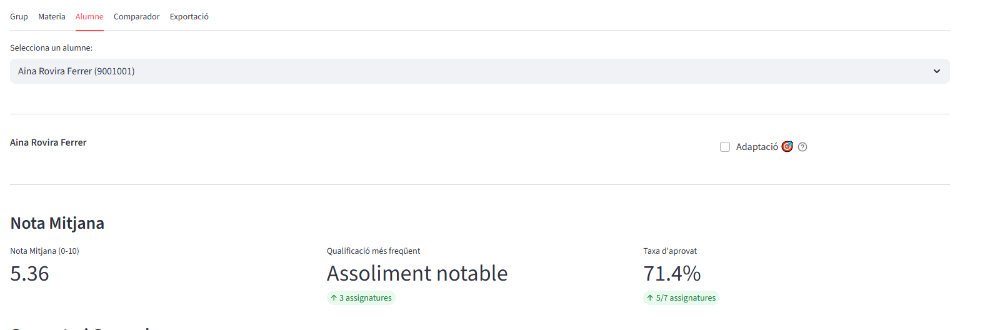
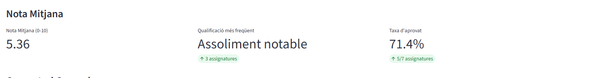
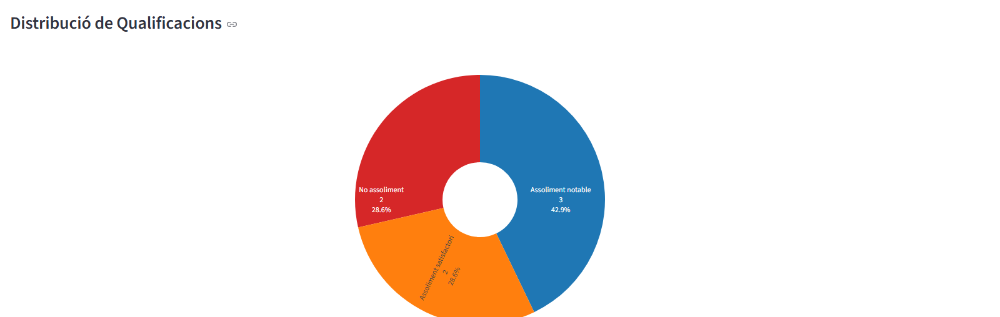

# Alumne

## Visio global del tab

La pestanya Alumne mostra el resum individual de rendiment, metriques principals i distribucio de qualificacions per orientar decisions personalitzades.

## Seccions detallades

### Flag d'adaptacio

Indicador per marcar i revisar rapidament si l'alumne esta treballant amb adaptacio.

### Nota Mitjana

Bloc de KPI amb mitjana numerica, qualificacio mes freqüent i taxa d'aprovat de l'alumne.

### Distribucio de Qualificacions

Grafica de composicio de resultats de l'alumne per categoria de qualificacio.

### Materies pendents

Quan existeixen no assoliments en el trimestre actiu, es mostra la seccio de materies pendents.

En el conjunt de captures actual no hi ha imatge d'aquesta seccio perque nomes apareix en casos on aplica.
