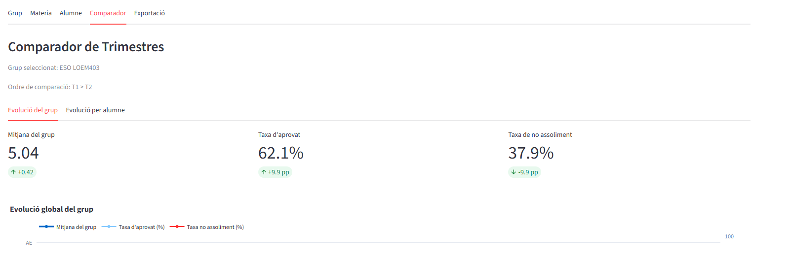
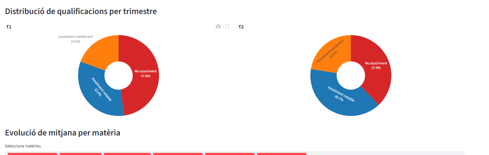
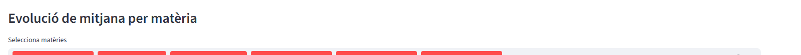
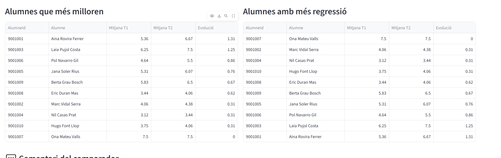
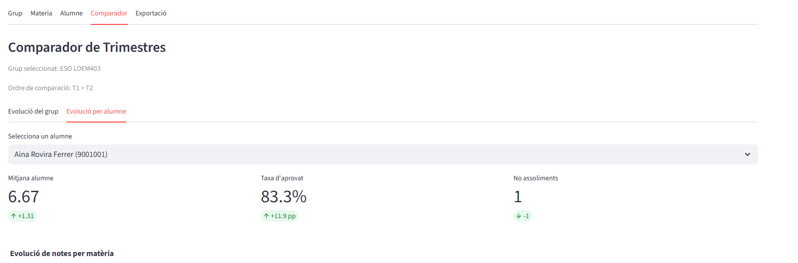
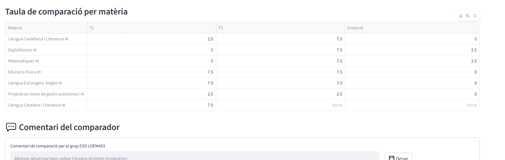

# Comparador

## Visio global del tab

La pestanya Comparador encreua dos trimestres per veure canvis de rendiment a nivell de grup i d'alumne.

## Seccions detallades

### Distribucio de qualificacions per trimestre

Compara la composicio de qualificacions entre T1 i T2 per detectar desplacaments de nivell.

### Evolucio de mitjana per materia

Mostra la tendencia de la mitjana per assignatura entre trimestres i ajuda a identificar millores o regressions.

### Alumnes que mes milloren

Taula dels alumnes amb evolucio positiva mes alta.

### Alumnes amb mes regressio

Taula dels alumnes amb caiguda de rendiment per prioritzar seguiment.

### Evolucio per alumne

Vista de KPI individuals i context del canvi entre trimestres per a un alumne concret.

### Taula de comparacio per materia

Detall per assignatura amb valors per trimestre i diferencia d'evolucio.

