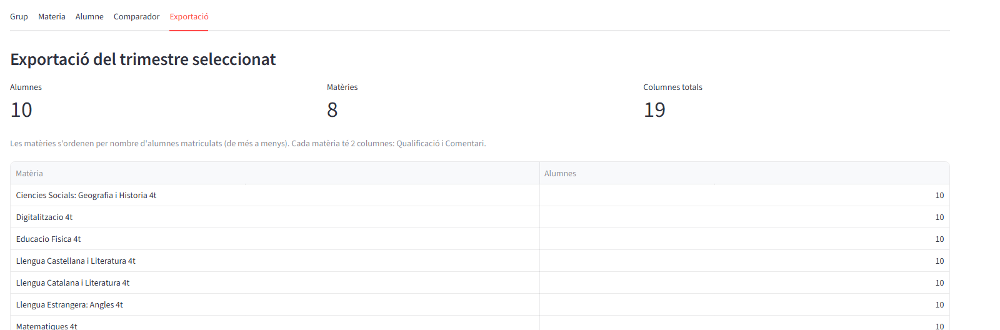

# Exportacio

## Visio global del tab

La pestanya Exportacio resumeix el trimestre seleccionat i prepara la sortida final en format CSV.

## Seccions detallades

### Resum del trimestre seleccionat

Mostra el nombre d'alumnes, el nombre de materies i el total de columnes que es generaran.

### Taula de materies

Llista les assignatures i el volum d'alumnat associat, base per validar l'abast de l'exportacio.

### Export final en CSV

El resultat es descarrega en format CSV per compartir o continuar el tractament de dades.
