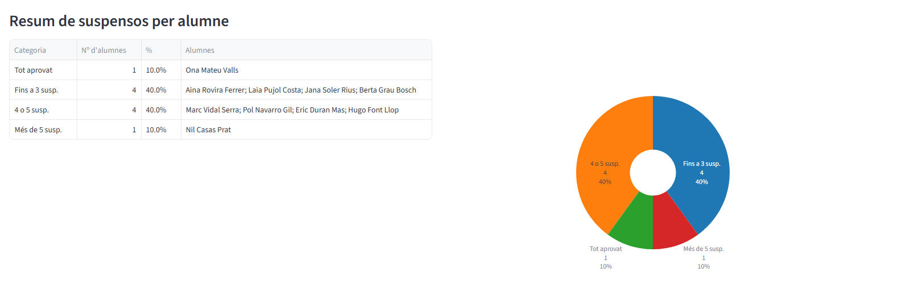
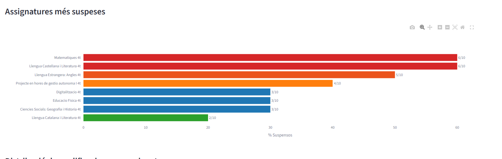
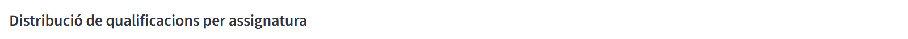
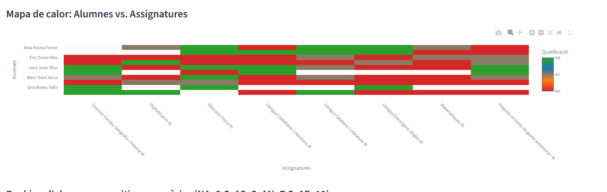
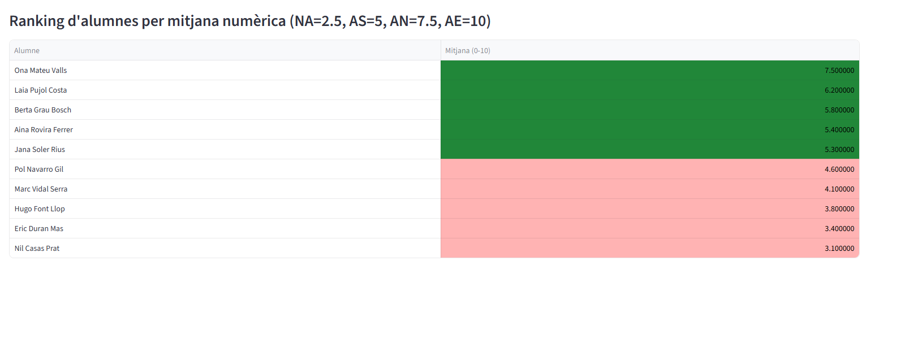

# Grup

## Visio global del tab

La pestanya Grup dona una fotografia general del trimestre seleccionat: distribucio de resultats, risc academic i patrons de rendiment per alumne i per assignatura.

## Seccions detallades

### Resum de suspensos per alumne

Mostra quants alumnes es concentren a cada franja de suspensos i ajuda a prioritzar intervencions de suport.

### Assignatures mes suspeses

Ranking de materies amb mes percentatge de no assoliment per detectar punts de risc curricular.

### Distribucio de qualificacions per assignatura

Visualitza, per cada materia, la composicio de qualificacions (NA, AS, AN, AE) i facilita comparar descompensacions.

### Mapa de calor: Alumnes vs. Assignatures

Creua alumnes i materies per identificar patrons individuals repetits i possibles concentracions de dificultat.

### Ranking d'alumnes per mitjana numerica

Ordena l'alumnat per una escala numerica derivada de la qualificacio per facilitar la lectura comparativa.

