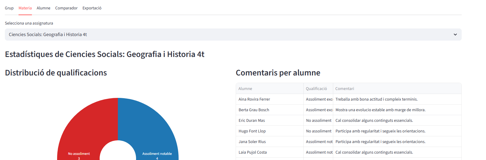
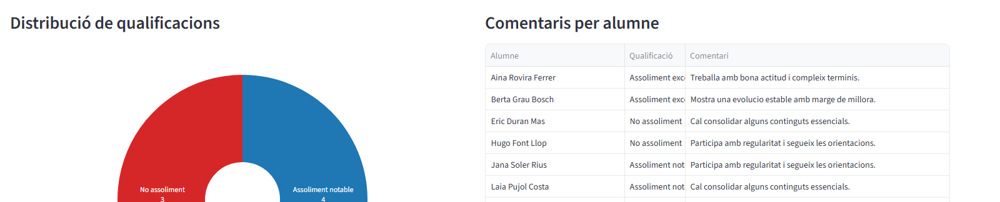
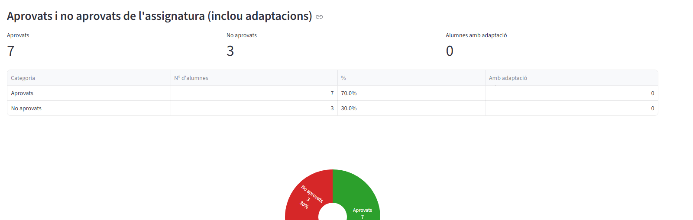

# Materia

## Visio global del tab

La pestanya Materia centra l'analisi en una assignatura concreta i combina distribucio de notes, comentaris qualitatius i estat d'aprovats/no aprovats.

## Seccions detallades

### Comentaris per alumne

Taula de seguiment individual amb qualificacio i observacions per facilitar tutories i reunions de seguiment.

### Distribucio de qualificacions per materia

Resumeix el pes de cada categoria de qualificacio dins de l'assignatura seleccionada.

### Aprovats i no aprovats de l'assignatura (inclou adaptacions)

Presenta comptadors i proporcions d'aprovats/no aprovats, incloent el context d'alumnes amb adaptacio.

